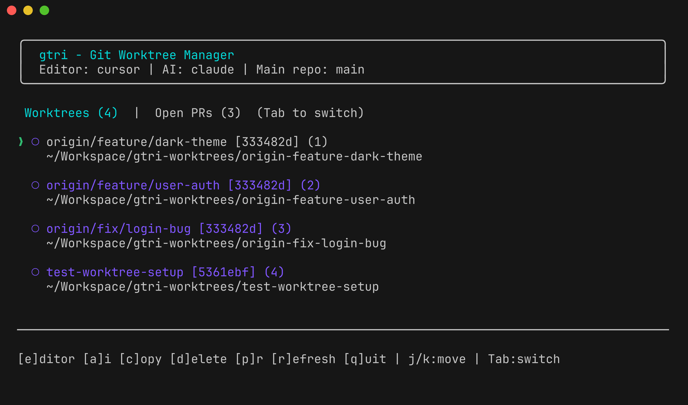
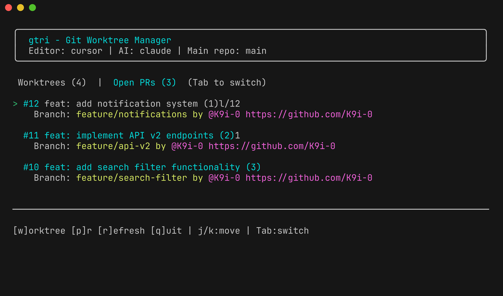

# gtri

[English](README.md)

> [git-worktree-runner](https://github.com/coderabbitai/git-worktree-runner) のインタラクティブTUI - AI駆動開発でworktree管理を実用的に

| Worktreesタブ | Open PRsタブ |
|---------------|--------------|
|  |  |

## なぜ gtri？

[git-worktree-runner (gtr)](https://github.com/coderabbitai/git-worktree-runner) はgit worktreeを管理する強力なツールで、AI駆動開発で特に便利です。しかし、日常的なworktree操作は手間がかかります：

- **gtr list** でworktreeを確認できますが、削除やPR確認、AIツール起動には追加コマンドが必要
- チームメンバーのPRをレビューするには、ブランチ名を調べてworktreeを手動で作成する必要がある

**gtri** はgtrをインタラクティブなTUIでラップし、これらのワークフローをスムーズにします：

| Worktreesタブ | Open PRsタブ |
|---------------|--------------|
| 既存worktreeの管理 | チームメンバーのPRレビュー |
| ワンキーでエディタ/AI起動 | ワンキーでworktree作成 |
| PR状態を一目で確認 | worktreeのないPRを一覧 |

## gtr と gtri の使い分け

| タスク | ツール | 理由 |
|--------|--------|------|
| 自分のタスク用worktree作成 | `gtr new` | ベースブランチを明示的に指定 |
| フック・設定の構成 | `.gtrconfig` | チーム共有設定 |
| 既存worktreeの管理 | `gtri` | 視覚的なナビゲーション、クイックアクション |
| チームメンバーのPRレビュー | `gtri` | PRを見て、即座にworktree作成 |

**gtri は中〜大規模のチームプロジェクトに最適** - 自分の作業と他者のPRレビューを頻繁に切り替える場面で力を発揮します。

### .gtrconfig のセットアップ

gtr はチーム共有設定用の [`.gtrconfig`](https://github.com/coderabbitai/git-worktree-runner?tab=readme-ov-file#configuration) ファイルをサポートしています。リポジトリにコミットしておきましょう：

```ini
[files]
include = .env.local, .env.development

[hooks]
postCreate = mise install, bun install

[defaults]
editor = cursor
ai = claude
```

gtri はエディタ/AI起動やworktree作成時にこれらの設定を自動的に使用します。

## 機能

- **2タブ構成**: Worktreesタブ + Open PRsタブ
- **Worktreesタブ**: PR状態付きで全worktreeを表示（Draft表示対応）
- **Open PRsタブ**: worktreeのないPRを一覧、`w`キーでworktree作成
- **クイックアクション**: エディタ起動（`e`）、AIコマンドコピー（`a`）、削除（`d`）
- **Vim/Emacsキーバインド**: j/k、Ctrl+N/Pでナビゲーション

## インストール

### ワンコマンドインストール

```bash
curl -fsSL https://raw.githubusercontent.com/K9i-0/gtri/main/install.sh | bash
```

### バイナリダウンロード

[GitHub Releases](https://github.com/K9i-0/gtri/releases) から最新バイナリをダウンロード

### ソースから

```bash
git clone https://github.com/K9i-0/gtri.git
cd gtri
bun install
bun run build
```

## 使い方

```bash
cd your-git-repo
gtri              # インタラクティブTUIを起動
gtri update       # 最新版にアップデート
gtri version      # バージョン表示
gtri help         # ヘルプ表示
```

## キーバインド

### 共通

| キー | 動作 |
|------|------|
| `Tab` | Worktrees/Open PRsタブを切り替え |
| `j` / `↓` / `Ctrl+N` | 下に移動 |
| `k` / `↑` / `Ctrl+P` | 上に移動 |
| `g` / `Ctrl+A` | 先頭に移動 |
| `G` / `Ctrl+E` | 末尾に移動 |
| `1-9` | 番号で選択 |
| `r` | リストを更新 |
| `q` / `Esc` | 終了 |

### Worktreesタブ

| キー | 動作 |
|------|------|
| `e` | エディタで開く |
| `a` | AIコマンドをクリップボードにコピー |
| `c` | worktreeパスをコピー |
| `d` | worktreeを削除 |
| `p` | PRをブラウザで開く |

### Open PRsタブ

| キー | 動作 |
|------|------|
| `w` | 選択したPRのworktreeを作成 |
| `p` | PRをブラウザで開く |

## 必要条件

- [git-worktree-runner](https://github.com/coderabbitai/git-worktree-runner) がインストールされていること
- [GitHub CLI (gh)](https://cli.github.com/) PR機能に必要

## 技術スタック

| 技術 | 用途 |
|------|------|
| [Bun](https://bun.sh/) | ランタイム、バンドラー、テストランナー、単一バイナリコンパイラ |
| [TypeScript](https://www.typescriptlang.org/) | 型安全な開発 |
| [React](https://react.dev/) + [Ink](https://github.com/vadimdemedes/ink) | Reactコンポーネントによるターミナルui |

### 特徴

- **薄いラッパー**: コア機能は実績あるツール（[gtr](https://github.com/coderabbitai/git-worktree-runner)、[gh](https://cli.github.com/)、git）に依存 - gtriは使いやすいUIを提供するだけ
- **単一バイナリ配布**: `bun build --compile` でランタイム不要のスタンドアロン実行ファイルを生成
- **クロスプラットフォーム**: darwin-arm64, darwin-x64, linux-x64 向けにビルド
- **CLIにReact**: 馴染みのあるReactパターンで宣言的なターミナルUIを構築

## ライセンス

MIT
